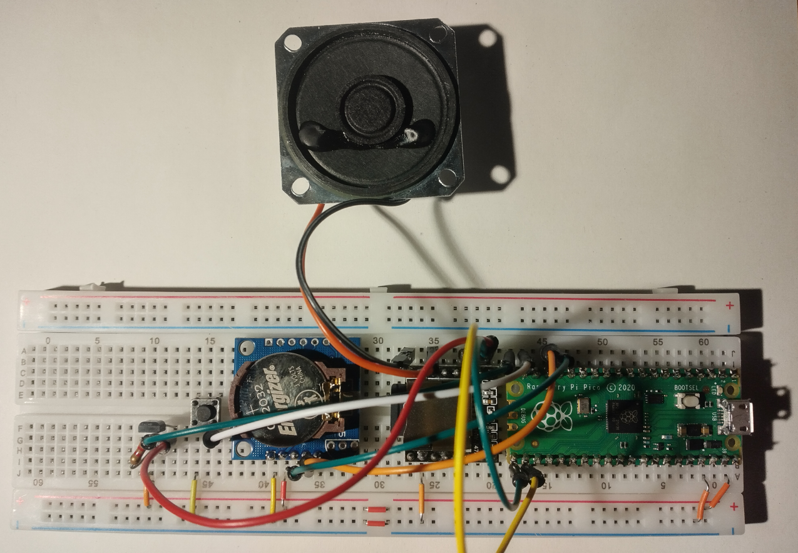

Martilab, fruit d'une collaboration entre le [FabLab Chaux-de-Fonds](fablab-chaux-de-fonds.ch) et le [Muzoo](https://muzoo.ch/) , propose une approche pratique pour encourager la nidification des martinets. En plaçant des haut-parleurs discrets diffusant des signaux sonores adaptés près des nichoirs, nous offrons aux martinets un environnement accueillant et stimulant. Une initiative simple et efficace pour favoriser la préservation de ces oiseaux migrateurs essentiels à notre écosystème. 

# liste des pièces

* [Microcontrôleur - Raspberry Pi Pico H](https://eu.mouser.com/ProductDetail/Raspberry-Pi/SC0917?qs=T%25252BzbugeAwjjvYEYcRJk%25252Bxw%253D%253D): Un microcontrôleur est un dispositif électronique intégré sur une puce (puce microélectronique) qui combine plusieurs composants essentiels pour le traitement de l'information. Il est conçu pour exécuter des tâches spécifiques dans des systèmes électroniques.

* [Horloge temps réel - D1Z RTC - DS1307](https://www.reichelt.com/ch/fr/shield-d1-horloge-temps-r-el-ds1307-d1z-rtc-p266069.html?&trstct=pos_0&nbc=1): Cette horloge temps réel utilise le circuit intégré DS1307 pour fournir une référence temporelle précise à un microcontrôleur.
* [Piles boutons - CR1220](https://www.reichelt.com/ch/fr/pile-bouton-lithium-c1220-blister-de-5-xcell-cr1220-5x-p365560.html?&trstct=pos_0&nbc=1):  Les piles boutons CR1220 sont des petites piles rondes au lithium. Elles sont souvent utilisées comme source d'alimentation pour des dispositifs électroniques compacts tels que des horloges, des capteurs et d'autres équipements électroniques.
* [Micro haut-parleur - LSM-40A/SQ](https://www.reichelt.com/ch/fr/haut-parleur-en-m-tal-raccord-soud--lsm-40a-sq-p145885.html?&trstct=pos_0&nbc=1): Un micro haut-parleur est un petit haut-parleur conçu pour émettre des sons dans des dispositifs compacts tels que des dispositifs portables, des jouets électroniques, ou d'autres projets électroniques nécessitant une sortie audio.
* [Lecteur mp3 - DFPlayer Mini](https://www.reichelt.com/ch/fr/arduino-dfplayer-mini-mp3-wav-microsd-karte-ard-dfpayer-mini-p289897.html?&trstct=pos_0&nbc=1): Un lecteur MP3 compact conçu pour être intégré dans des projets électroniques. Il prend en charge la lecture de fichiers audio stockés sur une carte micro SD, offrant une solution simple pour la lecture audio.
* [Carte micro SDHC](https://www.reichelt.com/ch/fr/carte-micro-sdhc-4-go-intenso-intenso-msdhc4g-p83730.html?&trstct=pos_0&nbc=1): Une carte mémoire au format micro SDHC, utilisée pour stocker des données telles que des fichiers audio, des images ou des données de configuration pour des dispositifs électroniques.
* [MOSFET PNP -ZVP2106ASTZ](https://eu.mouser.com/ProductDetail/Diodes-Incorporated/ZVP2106ASTZ?qs=wnTfsH77Xs53LehfD70aKA%3D%3D): Un transistor à effet de champ métal-oxyde-semiconducteur (MOSFET) de type PNP, utilisé pour la commutation de puissance dans des circuits électroniques.
* [Boîtier électronique - CB EAC-02-GY](https://www.reichelt.com/ch/fr/bo-tier-lectronique-110-x-70-x-45-mm-gris-cb-eac-02-gy-p317682.html?&trstct=pos_0&nbc=1): Un boîtier électronique conçu pour loger et protéger les composants électroniques d'un projet. Il offre une structure robuste et un espace organisé pour faciliter le montage.
* [JST PH 2-Pin Cable Male Header 200mm](https://eu.mouser.com/ProductDetail/Adafruit/3814?qs=%25252BEew9%25252B0nqrBFmoDCETN4BA%253D%253D): Un câble avec un connecteur mâle JST PH à deux broches de 200 mm de long. Les connecteurs JST PH sont couramment utilisés pour les connexions de puissance ou de données dans les projets électroniques.
* [36-pin Male Header Breakaway 10 pieces](https://eu.mouser.com/ProductDetail/Adafruit/392?qs=GURawfaeGuBPkJS%252B96amuQ%3D%3D): Une barrette de connecteurs mâles de 36 broches, pouvant être séparée en sections plus petites. Les headers sont souvent utilisés pour faciliter la connexion entre les cartes électroniques.
* [2 x 20 pin Female Headers](https://www.mouser.ch/ProductDetail/Adafruit/5583?qs=T%25252BzbugeAwjicPo%252FCTvtw2w%253D%253D): Deux barrettes de connecteurs femelles de 20 broches chacune. Elles sont utilisées pour créer des connexions entre des cartes ou des composants électroniques.
* [Barrette droite à une rangée de broches 2 pôles - JST PH ](https://www.reichelt.com/ch/fr/barrette-droite-une-rang-e-de-broches-2-p-les-grille2-mm-p-les-jst-ph2p-st-p185049.html?&trstct=pos_0&nbc=1): Une barrette de connecteurs droits à une rangée de deux broches, utilisée pour des connexions simples et compactes dans des projets électroniques. Les connecteurs JST PH offrent une connexion sécurisée.

# Prototype

