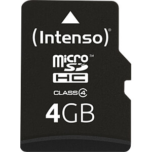
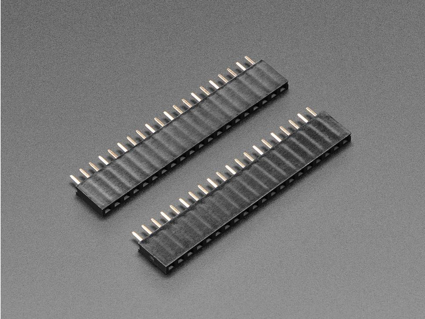
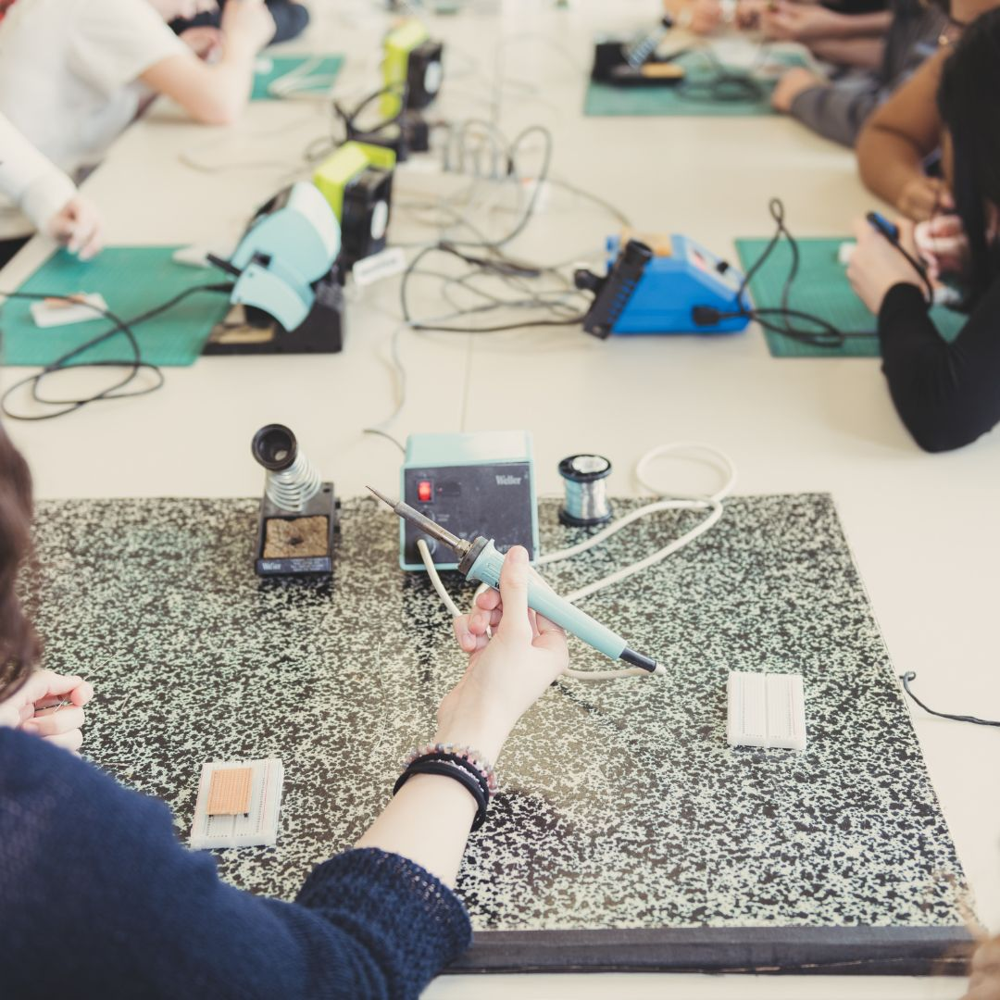

Martilab, fruit d'une collaboration entre le [FabLab Chaux-de-Fonds](fablab-chaux-de-fonds.ch) et le [Muzoo](https://muzoo.ch/) , propose une approche pratique pour encourager la nidification des martinets. En plaçant des haut-parleurs discrets diffusant des signaux sonores adaptés près des nichoirs, nous offrons aux martinets un environnement accueillant et stimulant. Une initiative simple et efficace pour favoriser la préservation de ces oiseaux migrateurs essentiels à notre écosystème. 

# Liste des pièces

| | |
| ----------- | ----------- |
|| [Microcontrôleur - Raspberry Pi Pico H](https://www.mouser.ch/ProductDetail/Raspberry-Pi/SC0917?qs=T%252BzbugeAwjjvYEYcRJk%252Bxw%3D%3D): Un microcontrôleur est un dispositif électronique intégré sur une puce (puce microélectronique) qui combine plusieurs composants essentiels pour le traitement de l'information. Il est conçu pour exécuter des tâches spécifiques dans des systèmes électroniques.     Le microcontrôleur est le cerveau du martilab. |
||[Horloge temps réel - D1Z RTC - DS1307](https://www.reichelt.com/ch/fr/shield-d1-horloge-temps-r-el-ds1307-d1z-rtc-p266069.html?&trstct=pos_0&nbc=1): Cette horloge temps réel utilise le circuit intégré DS1307 pour fournir une référence temporelle précise à un microcontrôleur.     L'horloge permet de connaître le temps absolu et d'activer la l'haut parleur à un moment de la journée.|
||[Piles boutons - CR1220](https://www.reichelt.com/ch/fr/pile-bouton-lithium-c1220-blister-de-5-xcell-cr1220-5x-p365560.html?&trstct=pos_0&nbc=1):  Les piles boutons CR1220 sont des petites piles rondes au lithium. Elles sont souvent utilisées comme source d'alimentation pour des dispositifs électroniques compacts tels que des horloges, des capteurs et d'autres équipements électroniques.      La pile permet à l'horloge de fonctionner même si le contrôleur est en veille. Ainsi, on connait toujours le temps absolu.
||[Lecteur mp3 - DFPlayer Mini](https://www.reichelt.com/ch/fr/arduino-dfplayer-mini-mp3-wav-microsd-karte-ard-dfpayer-mini-p289897.html?&trstct=pos_0&nbc=1): Un lecteur MP3 compact conçu pour être intégré dans des projets électroniques. Il prend en charge la lecture de fichiers audio stockés sur une carte micro SD, offrant une solution simple pour la lecture audio.|
||[Micro haut-parleur - LSM-40A/SQ](https://www.reichelt.com/ch/fr/haut-parleur-en-m-tal-raccord-soud--lsm-40a-sq-p145885.html?&trstct=pos_0&nbc=1): Un micro haut-parleur est un petit haut-parleur conçu pour émettre des sons dans des dispositifs compacts tels que des dispositifs portables, des jouets électroniques, ou d'autres projets électroniques nécessitant une sortie audio.|
||[JST PH 2-Pin Cable Male Header 200mm](https://www.mouser.ch/ProductDetail/Adafruit/3814?qs=%252BEew9%252B0nqrBFmoDCETN4BA%3D%3D): Un câble avec un connecteur mâle JST PH à deux broches de 200 mm de long. Les connecteurs JST PH sont couramment utilisés pour les connexions de puissance ou de données dans les projets électroniques.   Ce cable permet de relier le lecteur MP3 et le haut-parleur.|
||[Barrette droite à une rangée de broches 2 pôles - JST PH ](https://www.reichelt.com/ch/fr/barrette-droite-une-rang-e-de-broches-2-p-les-grille2-mm-p-les-jst-ph2p-st-p185049.html?&trstct=pos_0&nbc=1): Une barrette de connecteurs droits à une rangée de deux broches, utilisée pour des connexions simples et compactes dans des projets électroniques. Les connecteurs JST PH offrent une connexion sécurisée.   Connecteur pour le câble, afin de pouvoir facilement débrancher le haut-parleur.
||[Carte micro SDHC](https://www.reichelt.com/ch/fr/carte-micro-sdhc-4-go-intenso-intenso-msdhc4g-p83730.html?&trstct=pos_0&nbc=1): Une carte mémoire au format micro SDHC, utilisée pour stocker des données telles que des fichiers audio, des images ou des données de configuration pour des dispositifs électroniques.|
||[MOSFET PNP -ZVP2106ASTZ](https://eu.mouser.com/ProductDetail/Diodes-Incorporated/ZVP2106ASTZ?qs=wnTfsH77Xs53LehfD70aKA%3D%3D): Un transistor à effet de champ métal-oxyde-semiconducteur (MOSFET) de type PNP, utilisé pour la commutation de puissance dans des circuits électroniques.  Ce composent permet d'éteindre ([Commutateur à transistor côté haut](https://www.baldengineer.com/low-side-vs-high-side-transistor-switch.html)) le lecteur MP3 lorsque le martilab ne doit pas émettre de son. Ceci permet d'économiser de la batterie.|
||[Boîtier électronique - CB EAC-02-GY](https://www.reichelt.com/ch/fr/bo-tier-lectronique-110-x-70-x-45-mm-gris-cb-eac-02-gy-p317682.html?&trstct=pos_0&nbc=1): Un boîtier électronique conçu pour loger et protéger les composants électroniques d'un projet. Il offre une structure robuste et un espace organisé pour faciliter le montage. 
||[36-pin Male Header Breakaway 10 pieces](https://eu.mouser.com/ProductDetail/Adafruit/392?qs=GURawfaeGuBPkJS%252B96amuQ%3D%3D): Une barrette de connecteurs mâles de 36 broches, pouvant être séparée en sections plus petites. Les headers sont souvent utilisés pour faciliter la connexion entre les cartes électroniques.   Les pins évitent de devoir souder les dispositifs (Pico, RTC, DFPlayer) afin de pouvoir facilement les recycler et les utiliser dans d'autres projets.|
||[2 x 20 pin Female Headers](https://www.mouser.ch/ProductDetail/Adafruit/5583?qs=T%252BzbugeAwjicPo%2FCTvtw2w%3D%3D): Deux barrettes de connecteurs femelles de 20 broches chacune. Elles sont utilisées pour créer des connexions entre des cartes ou des composants électroniques.

## Option
| | |
| ----------- | ----------- |
| |[LiPo SHIM](https://www.pi-shop.ch/lipo-shim-for-pico): Le LiPo SHIM (Switch Input Module) for Pico est un module conçu spécifiquement pour le Raspberry Pi Pico. Il est destiné à fournir une interface de gestion d'alimentation pour les batteries LiPo (polymère de lithium). Ce module est généralement compact et s'installe facilement sur la carte Raspberry Pi Pico. Il intègre des composants permettant la charge de la batterie LiPo tout en assurant la sécurité de celle-ci, notamment en évitant la surcharge. De plus, le LiPo SHIM peut inclure un interrupteur d'alimentation pour activer ou désactiver l'alimentation du Raspberry Pi Pico, offrant ainsi un contrôle pratique de l'alimentation. Ce type de module est particulièrement utile pour des projets portables nécessitant une alimentation autonome avec des batteries LiPo.
|| [UPS Module](https://www.pi-shop.ch/ups-module-for-raspberry-pi-pico): Un module UPS (alimentation sans interruption) pour Raspberry Pi Pico est un accessoire qui assure une alimentation continue en cas de coupure de courant. Il intègre une batterie rechargeable pour maintenir l'alimentation pendant une durée déterminée, évitant ainsi la perte de données et garantissant un fonctionnement ininterrompu du Raspberry Pi Pico.

# Prototype
Les breadboards ou [platine d'expérimentation](https://fr.wikipedia.org/wiki/Platine_d%27exp%C3%A9rimentation) sont un outil essentiel pour le prototypage électronique en raison de leur facilité d'utilisation, de leur réutilisabilité, de leur facilité de dépannage, de leur flexibilité, de leur rapidité de prototypage et de leur accessibilité. Ils fournissent une plateforme pratique pour tester et développer des circuits électroniques avant de passer à des solutions plus permanentes, comme les [circuits imprimés](https://fr.wikipedia.org/wiki/Circuit_imprim%C3%A9).

# Schéma électrique
Un [schéma électrique](https://fr.wikipedia.org/wiki/Sch%C3%A9ma_%C3%A9lectrique) est une représentation graphique des composants d'un [circuit électrique](https://fr.wikipedia.org/wiki/Circuit_%C3%A9lectrique) et de leurs connexions. Il utilise des symboles normalisés pour représenter des éléments tels que les résistances, les condensateurs, les transistors, les sources d'énergie et les connexions. Ce schéma permet de visualiser la structure et le fonctionnement d'un circuit de manière claire et concise. Les lignes reliant les symboles représentent les connexions électriques entre les composants, décrivant ainsi le cheminement du courant électrique à travers le circuit. Les schémas électriques sont essentiels pour la conception, la documentation et la compréhension des circuits électriques, facilitant la communication entre les ingénieurs, les concepteurs et les techniciens.

# Design du circuit imprimé
Le design du [circuit imprimé (PCB)](https://fr.wikipedia.org/wiki/Circuit_imprim%C3%A9) est le processus de création et de planification d'un agencement spécifique des composants électroniques sur une plaque de circuit imprimé. Il englobe la disposition stratégique des composants tels que les résistances, les condensateurs, les transistors et les connecteurs, ainsi que les pistes conductrices qui les relient de manière à assurer la fonctionnalité électrique du circuit. Le concepteur de PCB prend en compte divers aspects tels que la minimisation des interférences électromagnétiques, la gestion thermique, la facilité de fabrication et d'assemblage, tout en veillant à optimiser l'espace et à répondre aux exigences spécifiques du circuit électronique à concevoir. Un design de circuit imprimé bien réalisé contribue à la performance, à la fiabilité et à la rentabilité globale du produit électronique final.

# Assemblage
Le placement des composants dans le processus de montage d'un PCB implique de positionner précisément les composants électroniques sur la carte en suivant le schéma électrique, soit manuellement, soit à l'aide d'une machine de placement automatique. Ensuite, le soudage des composants se fait pour fixer ceux-ci sur le PCB, que ce soit à travers un processus manuel avec un fer à souder ou à l'aide d'une machine de soudage automatique pour assurer une connexion stable et fiable.

| | |
| ----------- | ----------- |
|image| PCB sorti d'usine avec:    <li> **Substrat** : La base du PCB, généralement en matériau isolant comme le FR4, sur laquelle les autres éléments sont montés. <li> **Pistes conductrices** : Des chemins conducteurs en cuivre qui permettent le passage du courant électrique entre les différents composants. <li> **Pads** : Zones de surface métallique destinées à recevoir et à connecter les pattes des composants électroniques. <li> **Vias** : Connexions métalliques percées à travers le substrat pour relier les pistes de différentes couches du PCB. <li> **Couches internes** : Couches internes de cuivre dans le PCB utilisées pour relier les composants et les pistes sur différentes couches. <li> **Marquages** : Informations imprimées sur le PCB pour identifier les composants, les pistes et d'autres éléments lors du montage et du dépannage.
|image| Brasage du MOSFET, de la Résistance R1, du connecteur JST, et le boutton SW1.
|image| Brasage des barrettes de connecteurs femelles afin que les modules restent démontables
|image| Brasage du module RCT
|image| Connection des barette de connecteurs

# Software

## Circuit Python
[CircuitPython](https://circuitpython.org/) est un environnement de développement open source conçu pour faciliter la programmation des microcontrôleurs et des cartes de développement électronique, notamment celles de la famille Adafruit. Il s'agit d'une version spéciale du langage de programmation Python adaptée pour les systèmes embarqués. CircuitPython offre une interface simple et conviviale, permettant aux utilisateurs de démarrer rapidement avec la programmation sans avoir à se soucier des détails complexes de la configuration matérielle. Il prend en charge une large gamme de périphériques et de capteurs, offrant ainsi une flexibilité pour créer divers projets électroniques, des objets connectés aux dispositifs interactifs. Avec sa simplicité d'utilisation et sa documentation complète, CircuitPython est largement utilisé dans les projets maker, l'éducation et le prototypage rapide d'applications électroniques.

## Installation
### Installer CircuitPython sur le raspberry pi pico. 
Connectez le Raspberry Pi Pico à votre ordinateur via le cable USB.

Pour installer CircuitPython, veuillez suivre les instruction du [Getting started de CircuitPython](https://learn.adafruit.com/welcome-to-circuitpython/installing-circuitpython). 

Dans le cadre de ce projet, nous utilisons la [version 8.2.9](https://adafruit-circuit-python.s3.amazonaws.com/bin/raspberry_pi_pico/en_US/adafruit-circuitpython-raspberry_pi_pico-en_US-8.2.9.uf2).

### Copier code.py et boot.py
* **code.py** :
    Ce fichier est l'endroit où vous placez votre code principal, celui qui sera exécuté dès que le microcontrôleur ou la carte est alimenté ou redémarré.
    Il contient généralement le script principal de votre projet, qui peut contrôler les périphériques, lire des capteurs, effectuer des calculs, etc.
    Le contenu de code.py est exécuté en boucle, ce qui signifie que le code qu'il contient est constamment réexécuté, assurant le fonctionnement continu de votre projet.

* **boot.py** :
    Le fichier boot.py est exécuté une seule fois, juste après que le microcontrôleur ou la carte de développement a été alimenté ou redémarré.
    Il est principalement utilisé pour effectuer des tâches de configuration initiale, telles que l'initialisation des périphériques, la configuration des broches GPIO, ou d'autres paramètres de démarrage.
    Les tâches effectuées dans boot.py sont essentielles pour préparer l'environnement d'exécution avant que le code principal dans code.py ne commence à s'exécuter.

Il faut copier les fichier `code.py` (./software/code.py) et `boot.py` (./software/boot.py) sur le Raspberry Pi Pico.

Plus d'info sur le site de [circuitPython](https://learn.adafruit.com/welcome-to-circuitpython/creating-and-editing-code)

### Installer les dépendances
Coper le dossier `software/lib` sur le Raspberry Pi Pico.

Liste des dépendance: 
*  [Adafruit_CircuitPython_Register](https://github.com/adafruit/Adafruit_CircuitPython_Register): Utilisé pour réduire la consomation electrique, avec la bibliothèque `alarm`
* [Adafruit DS1307 Library](https://docs.circuitpython.org/projects/ds1307/en/latest/index.html): Pour contrôler le module RTC
* [DFPlayer](https://github.com/bablokb/circuitpython-dfplayer): Pour contrôler le module DFPlayer

### Réglage de l'horloge
Afin de régler l'horloge, il faut modifier le fichier `code.py` avec l'heure actuelle. Afin de pouvoir modifier le fichier `code.py`, il faut débrancher le Raspberry Pi Pico, presser le bouton debug, et re-brancher le Raspberry Pi Pico à l'ordinateur. 

Modifiez la ligne `init_time = time.struct_time(yyyy, mm, dd, HH, MM, SS, 0, -1, -1)`, en indiquant la date et l'heure, où 
* *yyyy* est l'année. Par exemple: 2024
* *mm* est le mois en 1 et 12. Par exemple: 2
* *jj* est le jour du mois entre 1 et 31. Par exemple: 25
* *HH* est l'heure entre 1 et 23. Par exemple: 19
* *MM* est la minute entre 1 et 59. Par exemple 59

Une fois la variable `init_time` modifié, vous pouvez sauvegarder le fichier `code.py`. 

Afin d'éviter que l'horloge s'initialise à nouveau, il faut commenter la ligne et re-sauvegarder le fichier `code.py`.

# Publications
[Linkedin](https://www.linkedin.com/feed/update/urn:li:activity:7173920802231193601): MUZOO & Fablab Chaux-de-Fonds au Tecday De La Broye pour faire chanter les martinets. Un partenariat unique alliant découverte des MINT pour les jeunes et préservation de la biodiversité... C'est ce que le MUZOO a réalisé et nous sommes fiers d'avoir été leurs partenaires ! ...

| | | |
| --- | --- | --- |
  |   |  

:camera: Gymnase Intercantonal de la Broye et Mélanie Thomas